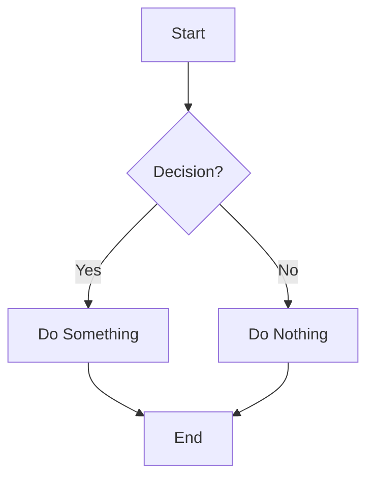

# Muhammad Ibnuh's Blog

Personal blog built with Jekyll using the Gale theme.

## Features

- Clean, minimal design
- Syntax highlighting for code blocks
- Mermaid diagram support
- Responsive design
- SEO optimized

## Mermaid Diagrams

This blog supports Mermaid diagrams for creating flowcharts, sequence diagrams, and other visualizations. You can use them in your posts in two ways:

### Method 1: Using Markdown Code Blocks

```markdown

```

### Method 2: Using the Custom Tag

```markdown

graph TD
    A[Start] --> B{Decision?}
    B -->|Yes| C[Do Something]
    B -->|No| D[Do Nothing]
    C --> E[End]
    D --> E

```

### Supported Diagram Types

- Flowcharts
- Sequence diagrams
- Class diagrams
- State diagrams
- Entity Relationship diagrams
- User Journey diagrams
- Gantt charts
- Pie charts
- Git graphs

### Styling

Mermaid diagrams are automatically styled to match your blog's theme with:
- Responsive design
- Dark theme compatibility
- Custom colors matching your accent colors
- Proper spacing and padding

## Development

### Prerequisites

- Ruby 3.4.3 or higher
- Bundler

### Setup

1. Clone the repository
2. Install dependencies: `bundle install`
3. Start the development server: `bundle exec jekyll serve`

### Building

```bash
bundle exec jekyll build
```

## License

This project is licensed under the MIT License.