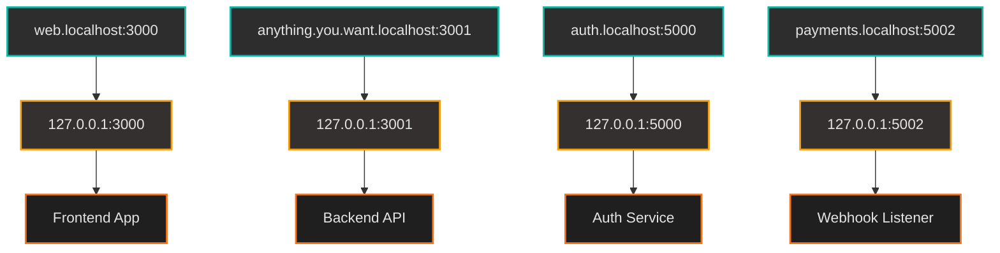
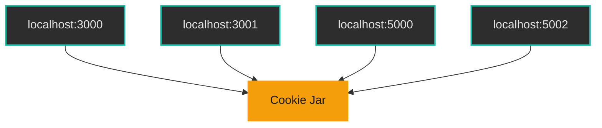

_A comprehensive guide to using .localhost domains for better local development environments._

If you're building modern web apps, you've probably already got a few services running locally, a frontend dev server, an API, maybe a mock auth service, Stripe webhooks, Postgres, etc. You run everything on `localhost` and a bunch of ports, and it works, sort of.

But when you start dealing with cookies, cross-origin requests, OAuth flows, HTTPS, and subdomains, the whole setup gets messy fast. That's where `.localhost` becomes super useful.

## How .localhost works

**Any subdomain under `*.localhost` automatically resolves to `127.0.0.1` (your local machine)**, this works on macOS, Linux, and Windows without any configuration. The operating system's DNS resolver handles this automatically.



## Clean multi-service dev environments

Running five different services on different ports sucks. `localhost:3000`, `localhost:3001`, `localhost:5000`, etc. doesn't scale, especially when frontend code needs to target different APIs.

Instead, you can use subdomains:

* `web.localhost` → your frontend
* `api.localhost` → backend service
* `auth.localhost` → auth or mock SSO
* `payments.localhost` → webhook listener

All of these resolve to `127.0.0.1`. You can route them however you want, via your dev proxy (e.g. Vite, Webpack, or Traefik), or just hardcode ports in your dev server.

* `web.localhost:3000` → your frontend
* `api.localhost:3001` → backend service
* `auth.localhost:5000` → auth or mock SSO
* `payments.localhost:5002` → webhook listener

Now your URLs look more like production, your app logic doesn't need to care about ports, and you can simulate things like origin-based routing and subdomain scoping.

## Why cookie behavior on `localhost` is misleading

If your app uses cookies for authentication or relies on things like `SameSite`, `Secure`, or `HttpOnly` flags, testing it on `localhost:3000` or `127.0.0.1:3000` can give you a false sense of confidence.

Here's why that setup quickly becomes unreliable.

### Ports do not separate cookies

Browsers do not consider the port when handling cookies. If you set a cookie on `localhost:3000`, it will also be sent to `localhost:3001`, `localhost:4000`, and so on. That might seem convenient during early development, but it introduces problems fast. It hides bugs related to cookie scope, especially when your architecture involves separate services such as a frontend, an API, and an authentication layer, each running on its own port.

In production, those services would live on separate domains or subdomains. On localhost, they all share the same cookie space. That leads to issues like:

* Cookies leaking between unrelated services
* Inability to properly test the Domain, Path, or SameSite behavior
* Bugs that only show up after deployment



### `127.0.0.1` and `localhost` are not treated the same

This one catches a lot of people off guard. Although `127.0.0.1` and `localhost` both point to your local machine, browsers treat them as different sites when it comes to cookies. If you log in on `localhost:3000` and then send a request to `127.0.0.1:3001`, the cookie will not go along. They are different cookie domains even though they hit the same server.

### Use `.localhost` subdomains instead

A better solution is to use named subdomains under `.localhost`, just like you would in production. For example:

* `web.localhost`
* `api.localhost`
* `auth.localhost`

Browsers treat these like real domain names. That gives you:

* True domain separation for each service
* Proper cookie sharing using `Domain=.localhost` when needed
* Support for SameSite and Secure flags, especially if you use HTTPS locally with something like mkcert
* More realistic cross-origin behavior for auth flows

### You catch problems before they go live

Using `.localhost` subdomains in development helps you simulate production behavior more closely. It lets you:

* Test cookie-based auth across services
* Debug cross-origin issues early
* Avoid unexpected bugs related to cookies when your app goes live

If your app uses cookies for anything serious, switching to `.localhost` subdomains is a simple step that pays off quickly.

Some reasons:

* localStorage and sessionStorage are properly isolated by subdomain, not by port
* Browsers handle .localhost subdomains like real domains, not like IP addresses
* SameSite=None requires HTTPS, which .localhost supports easily with mkcert
* CORS and credentials work as expected across subdomains
* URLs look more like production environments

Using .localhost subdomains gives you a better testing ground:

* Set Domain=.localhost in your cookie and share it across web.localhost, api.localhost, etc.
* Test SameSite, Secure, and HttpOnly cookie behavior in a way that mirrors production setups.
* localStorage and sessionStorage behave consistently across your development environment.

It avoids a ton of weird edge cases and bugs that only show up when things go live.

## Reserved by spec, supported everywhere

Per [RFC 6761](https://www.rfc-editor.org/rfc/rfc6761.html), `.localhost` is a reserved TLD. It's not just a convention, it's guaranteed to resolve to `127.0.0.1` or `::1`, without hitting external DNS servers.

**This works on all major operating systems:**
- **macOS**: Built-in DNS resolver handles `.localhost` automatically
- **Linux**: Systemd-resolved and other DNS resolvers support `.localhost`
- **Windows**: Windows DNS resolver recognizes `.localhost` domains

That means:

* **No DNS leaks.** Even if your DNS config is broken or your VPN hijacks lookups, `.localhost` stays local.
* **No external traffic.** Every request to a `.localhost` domain stays on your machine.
* **No surprise conflicts.** `.localhost` is unregistrable, nobody can ever buy `shop.localhost` and serve you malware.
* **Cross-platform compatibility.** Works the same way on macOS, Linux, and Windows.

It's designed specifically for local dev.

## TLS support with tools like mkcert

Modern browsers won't let you do much with cookies or credentials unless you're using HTTPS, especially when `SameSite=None` is involved.

Normally, running HTTPS locally is a pain. But `.localhost` is supported by tools like [`mkcert`](https://github.com/FiloSottile/mkcert), which can generate a trusted certificate for any `*.localhost` domain without buying or configuring anything. That means you can get:

* `https://web.localhost`
* `https://auth.localhost`
* `https://api.localhost`

All running with valid TLS, no scary browser warnings, and full cookie support.

### Setting up mkcert

```bash
# Install mkcert
brew install mkcert  # macOS
# or
sudo apt install mkcert  # Ubuntu/Debian
# or
choco install mkcert  # Windows (Chocolatey)

# Install the local CA
mkcert -install

# Generate certificates for your domains
mkcert web.localhost api.localhost auth.localhost
```

## Works well with proxies, containers, and dev tools

A lot of local setups now run in containers or use proxies like Traefik, NGINX, or Vite's dev server.

`.localhost` fits nicely into these setups:

* You can use subdomain routing to map `web.localhost` to one container and `api.localhost` to another.
* Proxies can route based on host headers, just like they would in production.
* Frontend tools like Vite, Next.js, and Create React App already support `localhost` subdomains out of the box.
* Test frameworks like Cypress treat `.localhost` as a trusted domain.

If you've ever hit weird problems with CORS or local dev URLs in containers, `.localhost` solves a lot of those by giving you clean, separate domains with consistent behavior.

### Example Vite configuration

```javascript
// vite.config.js
export default {
  server: {
    host: 'web.localhost',
    port: 3000,
    https: true
  }
}
```

### Example Docker Compose setup

```yaml
# docker-compose.yml
version: '3.8'
services:
  web:
    image: nginx
    ports:
      - "80:80"
    volumes:
      - ./nginx.conf:/etc/nginx/nginx.conf
    extra_hosts:
      - "web.localhost:127.0.0.1"
      - "api.localhost:127.0.0.1"
```

## Practical implementation examples

### 1. Development environment setup

Create a simple script to set up your local environment:

```bash
#!/bin/bash
# setup-localhost.sh

# Note: No need to modify /etc/hosts on modern systems
# .localhost domains resolve automatically to 127.0.0.1

# Generate SSL certificates
mkcert web.localhost api.localhost auth.localhost

echo "Localhost domains configured!"
echo "web.localhost, api.localhost, and auth.localhost now resolve to 127.0.0.1"
```

### 2. Environment variables

Use environment variables to switch between local and production URLs:

```javascript
// config.js
const isDev = process.env.NODE_ENV === 'development';

export const config = {
  apiUrl: isDev ? 'https://api.localhost' : 'https://api.production.com',
  authUrl: isDev ? 'https://auth.localhost' : 'https://auth.production.com',
  webUrl: isDev ? 'https://web.localhost' : 'https://app.production.com'
};
```

### 3. Testing with Cypress

```javascript
// cypress.config.js
export default {
  e2e: {
    baseUrl: 'https://web.localhost:3000',
    supportFile: false,
    specPattern: 'cypress/e2e/**/*.cy.{js,jsx,ts,tsx}'
  }
}
```

## Common gotchas and solutions

### 1. Browser caching

Sometimes browsers cache DNS lookups aggressively. If you're having issues:

```bash
# Clear DNS cache on macOS
sudo dscacheutil -flushcache; sudo killall -HUP mDNSResponder

# On Linux
sudo systemctl restart systemd-resolved

# On Windows
ipconfig /flushdns
```

### 2. Port conflicts

Make sure your services are running on the expected ports:

```bash
# Check what's running on port 3000
lsof -i :3000

# Or use netstat
netstat -tulpn | grep :3000
```

### 3. SSL certificate issues

If you're getting SSL errors:

```bash
# Reinstall mkcert CA
mkcert -install

# Regenerate certificates
mkcert -key-file key.pem -cert-file cert.pem web.localhost api.localhost
```

## Final thoughts

`.localhost` isn't a throwaway dev hack, it's part of the spec for a reason. It gives you:

* **Local-only domains** that are DNS-safe and work on macOS, Linux, and Windows
* **Clean subdomain structure** for microservices or frontends
* **Accurate cookie, storage, and CORS behavior**
* **Easy HTTPS** with tools like mkcert
* **Less config and fewer bugs** when you go live

If you're still doing everything on `localhost:3000` and crossing your fingers during deploys, it's worth switching things up. Build your local dev like your production setup, and `.localhost` is the simplest way to get there.

The investment in setting up a proper local development environment with `.localhost` domains pays off quickly when you avoid the debugging nightmares that come from environment mismatches between development and production. 